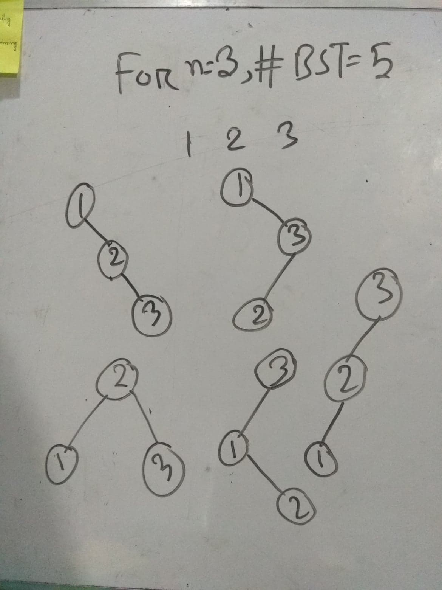

# [1170 - Counting Perfect BST](http://lightoj.com/volume_showproblem.php?problem=1170)  

সংক্ষেপে, এই প্রব্লেমে আপনাকে একটা রেইঞ্জ দেওয়া থাকবে `a` থেকে `b`। আপনাকে প্রিন্ট করাতে হবে `a` থেকে `b` এর মধ্যে যতগুলো [পার্ফেক্ট পাওয়ার](https://en.wikipedia.org/wiki/Perfect_power) আছে তাদেরকে নিয়ে কতগুলো ভিন্ন ভিন্ন [বাইনারী সার্চ ট্রি](https://hellohasan.com/category/data-structure/tree/binary-search-tree-bst/)  বানানো সম্ভব।  

## Tags

`বাইনারী সার্চ`,`বাইনারী সার্চ ট্রি` , `কাতালান নাম্বার`

## Hint

  
    Hint 1

একটা রেইঞ্জে কতগুলি পার্ফেক্ট পাওয়ার পসিবল? এটা কি কনস্ট্যান্ট?

  
    Hint 2

n টা ভিন্ন ভিন্ন নাম্বার দিয়ে কতগুলি ভিন্ন ভিন্ন বাইনারী সার্চ ট্রি বানানো সম্ভব?

## Solution

  

৩ টা ভিন্ন ভিন্ন নোড বা কী এর জন্য আমরা ভিন্ন ভিন্ন ৫ টি বাইনারী সার্চ ট্রি বানাতে পারি। সাধারনত, n টি ভিন্ন ভিন্ন কী এর জন্য আমরা  `(2n)! / ((n + 1)! * n!)` টি বাইনারী সার্চ ট্রি পাবো।
এদেরকে কাতালান নাম্বার ও বলা হয়ে থাকে। প্রথম কিছু কাতালান নাম্বার হলো, n=0,1,2,3,4..... এর জন্য 1,1,2,5,14......।  আর একটা রেইঞ্জ a থেকে b এর মধ্যে নির্দিষ্ট পরিমান পার্ফেক্ট পাওয়ার থাকে। তাহলে আমাদের সমস্যাটি দাড়ালোঃ  
- a থেকে b এর মধ্যে কতগুলি পার্ফেক্ট পাওয়ার আছে।  

যেহেতু আমাদের b এর রেইঞ্জ ১০১০ এর মধ্যে,সেহেতু আমাদের পার্ফেক্ট পাওয়ার ১০০০০০২ এর বেশি হবে নাহ। আমরা তাহলে O(nlogn) এ দরকারী সবগুলো  
পার্ফেক্ট পাওয়ার প্রিপ্রোসেস করে রাখতে পারি। তারপর,এই লিস্ট এর উপর বাইনারী সার্চ চালিয়ে a থেকে b এর মধ্যে কতগুলো পার্ফেক্ট পাওয়ার আছে তা বের করতে পারি। এটা বের করার সহজ উপায়  
হচ্ছে সিপ্লাসপ্লাস এর স্ট্যান্ডার্ড টেমপ্লেট লাইব্রেরী থেকে [আপার বাউন্ড](https://www.geeksforgeeks.org/upper_bound-in-cpp/) এবং [লোয়ার বাউন্ড](https://www.geeksforgeeks.org/lower_bound-in-cpp/) ব্যাবহার করা।  
- এখন আমরা জানি যে আমাদের a থেকে b রেইঞ্জে কতগুলি পার্ফেক্ট পাওয়ার আছে। ধরা যাক,a থেকে b পর্যন্ত  n সংখ্যাক পার্ফেক্ট পাওয়ার আছে।  

তাহলে আমাদের প্রিন্ট করাতে হবে n পার্ফেক্ট পাওয়ার দিয়ে কতগুলি ভিন্ন ভিন্ন বাইনারী সার্চ ট্রি বানানো যায়।`(2n)! / ((n + 1)! * n!)` ইকুইশন দিয়ে আমরা এন্সার পেয়ে যেতে পারি অথবা ডাইনামিক প্রোগ্রামিং ব্যবহার করে প্রিপ্রোসেস করে নিতে পারি। কারন আমাদের প্রব্লেম এ উল্ল্যেখ করা আছে b-a<=106 হবে। তাহলে,আমরা সর্বোচ্চ ১২০০ টি পার্ফেক্ট পাওয়ার পেতে পারি যেকোনো রেইঞ্জের জন্য। 

  
    কিভাবে ডিপি কাজে লাগবে?

 

